# KGN Architecture

> KGN is a CLI + MCP server that gives AI agents **persistent, queryable memory** — backed by PostgreSQL and pgvector.  
> This document provides a comprehensive visual guide to KGN's internal architecture using Mermaid diagrams.

---

## Table of Contents

1. [System Overview](#1-system-overview)
2. [Layer Architecture](#2-layer-architecture)
3. [Module Dependency Graph](#3-module-dependency-graph)
4. [Database Schema](#4-database-schema)
5. [Ingest Pipeline](#5-ingest-pipeline)
6. [Task Lifecycle](#6-task-lifecycle)
7. [Task Checkout — Context Package](#7-task-checkout--context-package)
8. [Embedding & Similarity Search](#8-embedding--similarity-search)
9. [Interface Layer](#9-interface-layer)
10. [MCP Server Tools](#10-mcp-server-tools)
11. [LSP Server Capabilities](#11-lsp-server-capabilities)
12. [Orchestration Layer](#12-orchestration-layer)
13. [Sync & GitHub Integration](#13-sync--github-integration)
14. [Conflict Detection](#14-conflict-detection)
15. [Workflow Engine](#15-workflow-engine)
16. [End-to-End Data Flow](#16-end-to-end-data-flow)

---

## 1. System Overview

A bird's-eye view of the entire KGN system — from file input to interface output.

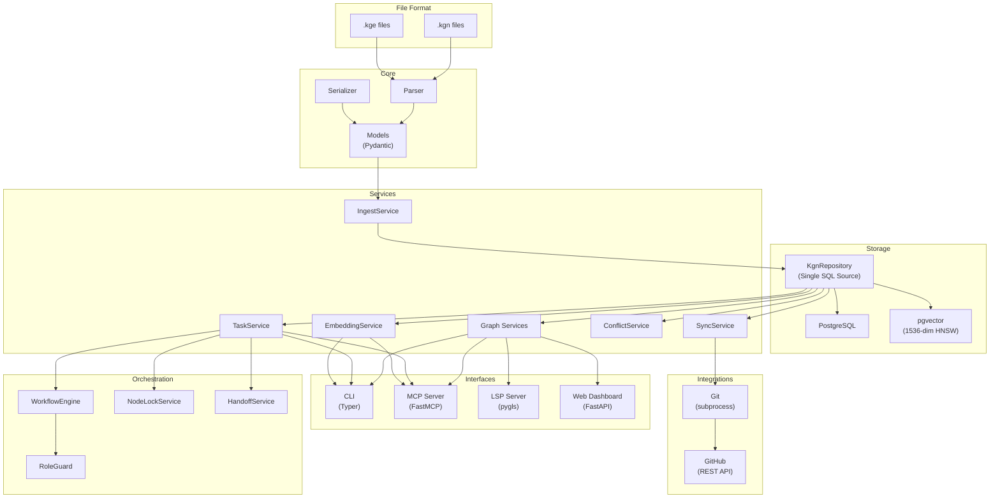

---

## 2. Layer Architecture

KGN is organized into 7 layers. Each layer only depends on the layers below it.

| Layer | Responsibility | Key Technologies |
|---|---|---|
| **Layer 0** — File Format | Custom `.kgn`/`.kge` (YAML frontmatter + Markdown) | — |
| **Layer 1** — Core | Parsing, data models, serialization, errors | Pydantic v2 |
| **Layer 2** — Storage | All SQL queries, connection pooling, migrations | PostgreSQL, pgvector, psycopg3 |
| **Layer 3** — Services | Business logic: ingest, graph, embedding, task, conflict, sync | OpenAI API |
| **Layer 4** — Orchestration | Multi-agent coordination: roles, workflows, locking, handoff | — |
| **Layer 5** — Interfaces | Four access points: CLI, MCP, LSP, Web | Typer, FastMCP, pygls, FastAPI |
| **Layer 6** — Integrations | Version control and remote sync | Git, GitHub REST API |

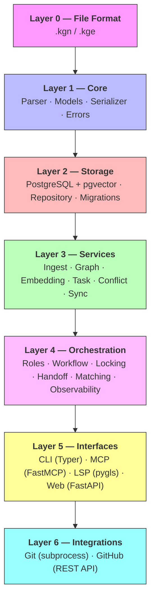

---

## 3. Module Dependency Graph

Every module in `kgn/` and its direct dependencies. Arrows point from consumer to dependency.

- **Core modules** (`models`, `parser`, `serializer`, `errors`) have no circular dependencies.
- **`db/repository.py`** is the single SQL source — all services depend on it.
- **Interface modules** (`cli`, `mcp`, `lsp`, `web`) sit at the top, consuming services.

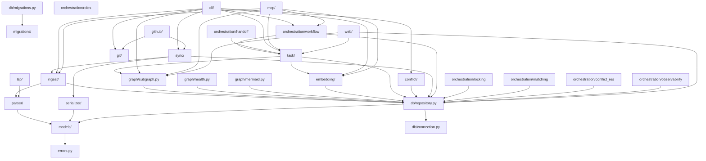

---

## 4. Database Schema

KGN uses PostgreSQL with the pgvector extension. All tables are managed through sequential SQL migrations (`001`–`009`).

Key design decisions:
- **`nodes`** stores all knowledge graph nodes with a polymorphic `type` column.
- **`node_embeddings`** uses pgvector's `vector(1536)` type with an HNSW index for fast cosine similarity search.
- **`node_versions`** auto-captures a snapshot before every update (audit trail).
- **`agent_activities`** is INSERT-only — never updated or deleted (Rule R5).
- **`task_queue`** implements a state machine with lease-based checkout.

```mermaid
erDiagram
    projects ||--o{ nodes : contains
    projects {
        uuid id PK
        string name
        timestamp created_at
    }

    agents ||--o{ nodes : creates
    agents {
        uuid id PK
        string key UK
        AgentRole role
        timestamp created_at
    }

    nodes ||--o{ node_versions : "version history"
    nodes ||--o| node_embeddings : "has embedding"
    nodes ||--o{ edges : "from"
    nodes ||--o{ edges : "to"
    nodes ||--o{ task_queue : "is task"
    nodes {
        uuid id PK
        uuid project_id FK
        NodeType type
        NodeStatus status
        string title
        text body_md
        string[] tags
        float confidence
        string content_hash
        uuid created_by FK
        uuid lock_holder FK
        timestamp lock_expires
        timestamp created_at
        timestamp updated_at
    }

    node_versions {
        uuid id PK
        uuid node_id FK
        int version_num
        jsonb snapshot
        timestamp created_at
    }

    node_embeddings {
        uuid node_id PK_FK
        vector_1536 embedding
        timestamp created_at
    }

    edges {
        uuid id PK
        uuid from_id FK
        uuid to_id FK
        EdgeType type
        float weight
        jsonb properties
    }

    task_queue {
        uuid id PK
        uuid task_node_id FK
        TaskState state
        int priority
        uuid agent_id FK
        timestamp lease_expires
        int attempt
        string reason
    }

    kgn_ingest_log {
        uuid id PK
        string operation
        uuid node_id FK
        string result
        timestamp created_at
    }

    agent_activities {
        uuid id PK
        uuid agent_id FK
        ActivityType type
        uuid target_node_id FK
        jsonb metadata
        timestamp created_at
    }
```

---

## 5. Ingest Pipeline

The ingest pipeline transforms raw `.kgn`/`.kge` text into database records. It handles ID resolution (converting `new:slug` to UUIDs), content-hash deduplication, and project binding in a single pass.

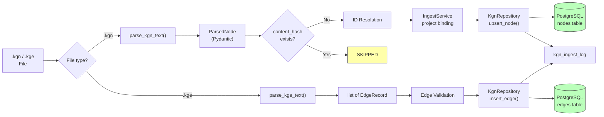

---

## 6. Task Lifecycle

Tasks follow a state machine pattern with lease-based checkout. When an agent checks out a task, a lease timer starts. If the lease expires before completion, the task is automatically recovered to READY state.

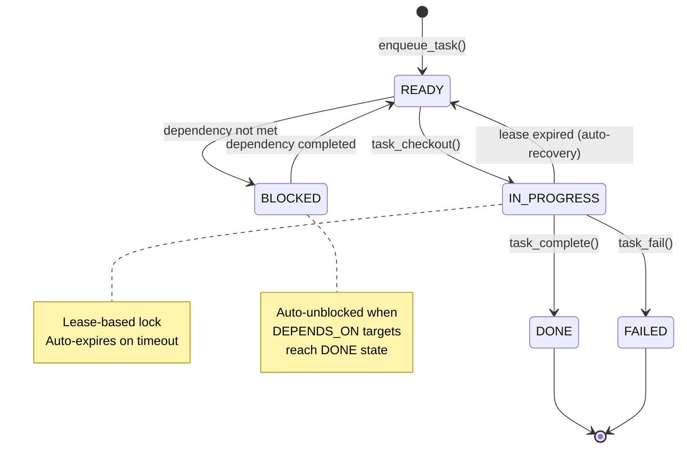

---

## 7. Task Checkout — Context Package

When an AI agent calls `task_checkout`, KGN doesn't just return the task — it builds a **ContextPackage** containing the task details, its surrounding subgraph (2-hop BFS), and semantically similar nodes. This gives the agent everything it needs to work without extra queries.

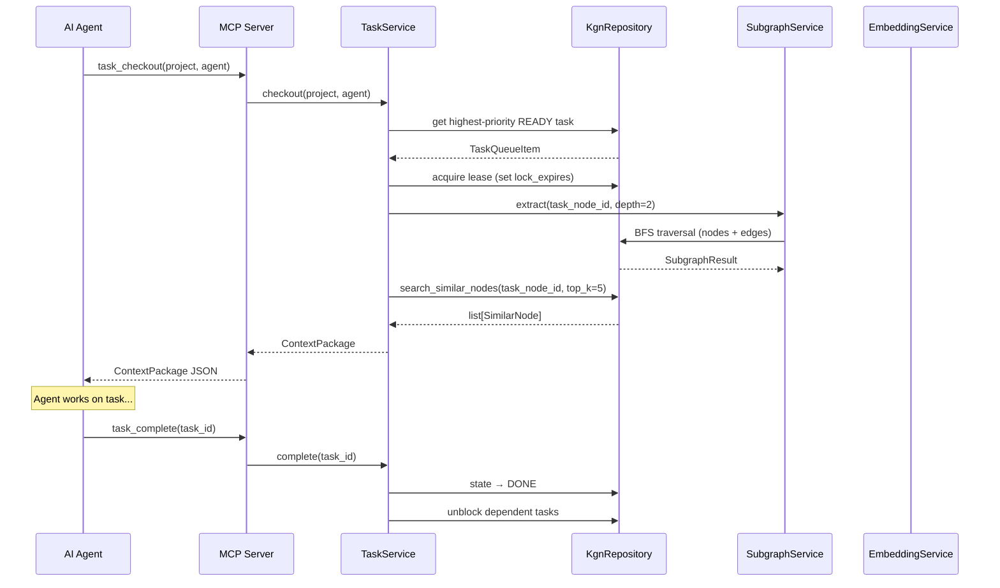

---

## 8. Embedding & Similarity Search

KGN uses OpenAI's `text-embedding-3-small` model to generate 1536-dimensional vectors from node body text. These vectors are stored in pgvector with an HNSW index, enabling fast cosine similarity search across the entire knowledge graph.

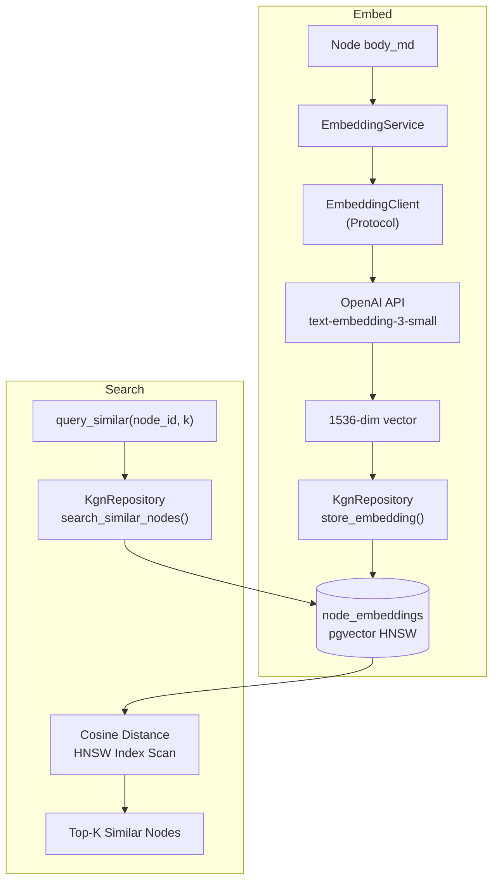

---

## 9. Interface Layer

KGN exposes the same service layer through four independent interfaces. Each interface is a thin adapter — no business logic lives in the interface layer.

| Interface | Framework | Transport | Use Case |
|---|---|---|---|
| **CLI** | Typer + Rich | Terminal | Developer workflows, scripting, CI/CD |
| **MCP Server** | FastMCP | stdio / SSE / HTTP | AI agent integration (Claude) |
| **LSP Server** | pygls | stdio | IDE support (VS Code) |
| **Web Dashboard** | FastAPI + Jinja2 | HTTP | Visual exploration, monitoring |

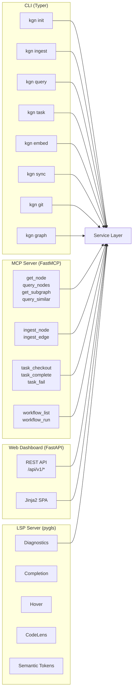

---

## 10. MCP Server Tools

The MCP server provides 12 tools across 4 categories that AI agents can call. All tools delegate to the service layer — MCP handlers contain no business logic (Rule R12).

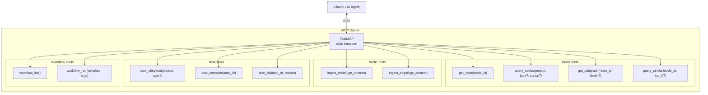

---

## 11. LSP Server Capabilities

The Language Server provides IDE-level support for `.kgn` and `.kge` files. It uses the tolerant parser (`parse_kgn_tolerant`) which never throws exceptions, ensuring real-time diagnostics work even on incomplete or malformed files.

The workspace indexer maintains an in-memory O(1) lookup table for all nodes and edges, enabling instant completions and hover info.

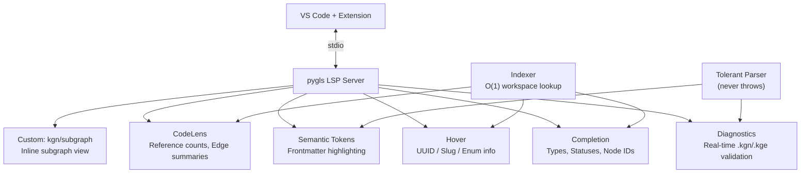

---

## 12. Orchestration Layer

The orchestration layer coordinates multiple AI agents working on the same knowledge graph. It enforces role-based permissions, manages concurrent access through lease-based locking, and propagates context between sequential tasks.

| Component | Responsibility |
|---|---|
| **RoleGuard** | Permission enforcement per AgentRole (genesis / worker / reviewer / indexer / admin) |
| **WorkflowEngine** | Declarative task decomposition — templates define step sequences and dependencies |
| **NodeLockService** | Lease-based pessimistic locking to prevent concurrent modifications |
| **HandoffService** | Context propagation between sequential workflow steps |
| **MatchingService** | Assigns tasks to agents based on role compatibility and current load |
| **ConflictResolutionService** | Detects concurrent edits and mediates resolution |
| **ObservabilityService** | Tracks agent activities, measures throughput, detects bottlenecks |

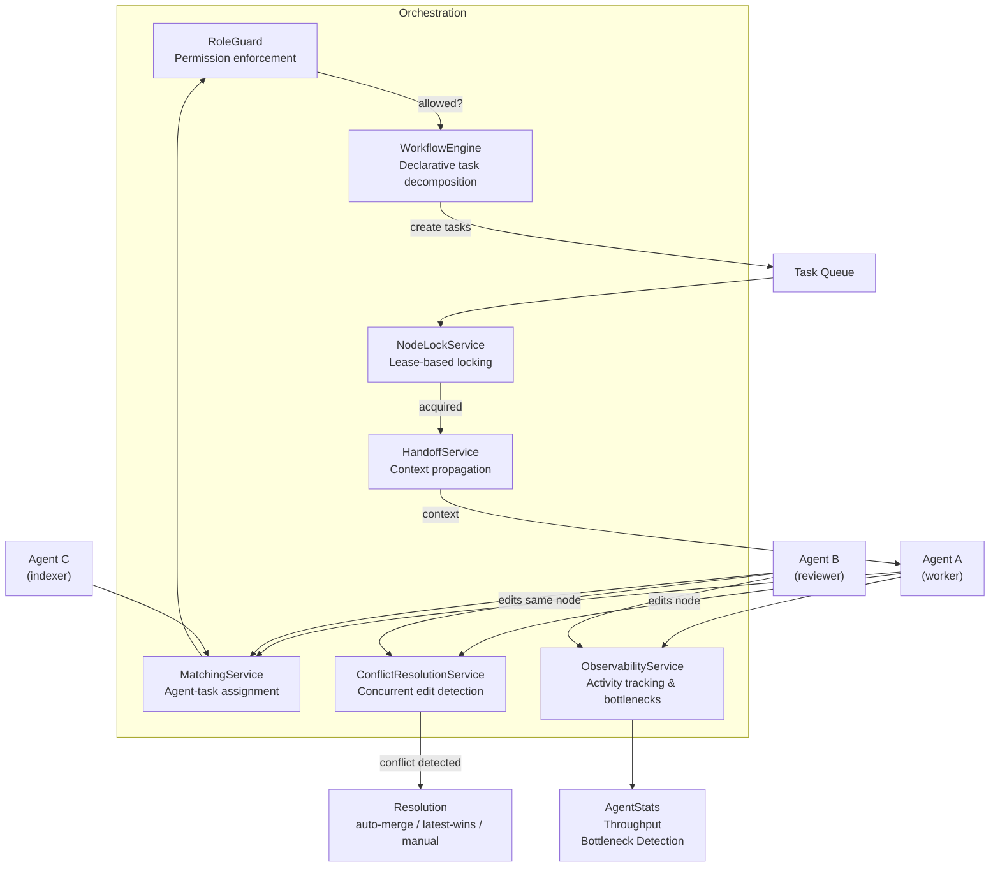

---

## 13. Sync & GitHub Integration

KGN treats PostgreSQL as the local working engine and GitHub as the long-term source of truth. The sync layer handles bidirectional conversion between DB records and `.kgn`/`.kge` files, with Git providing version control and GitHub providing remote storage and collaboration.

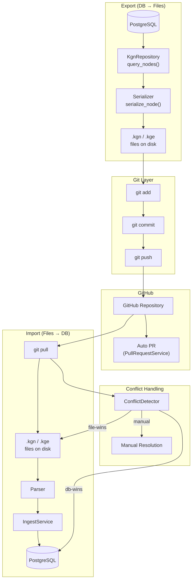

---

## 14. Conflict Detection

KGN detects potential knowledge conflicts by comparing node embeddings via cosine similarity. When two nodes exceed the similarity threshold (default 0.92), they are flagged as conflict candidates. Optionally, a `CONTRADICTS` edge is auto-created to make the conflict visible in the graph.

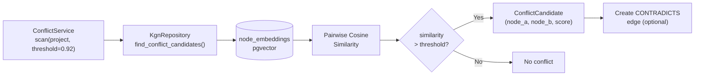

---

## 15. Workflow Engine

The workflow engine decomposes high-level processes into task DAGs. Each `WorkflowTemplate` defines a sequence of steps with dependency edges. When executed, the engine creates TASK nodes, wires them with `DEPENDS_ON` edges, and enqueues them in priority order. Downstream tasks start as BLOCKED and auto-transition to READY as their dependencies complete.

Built-in templates:

| Template | Pipeline | Description |
|---|---|---|
| `design-to-impl` | GOAL → SPEC → ARCH → TASK(impl) → TASK(review) | Full design-to-implementation |
| `issue-resolution` | ISSUE → TASK(fix) → TASK(verify) | Bug fix workflow |
| `knowledge-indexing` | GOAL → TASK(index) → TASK(review) | Knowledge capture |

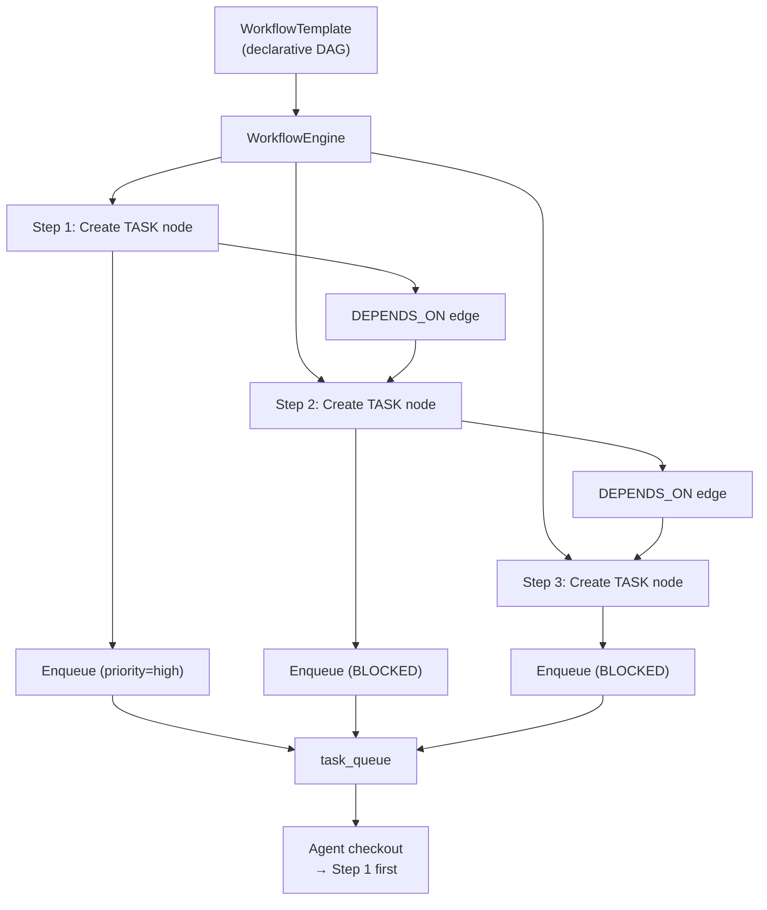

---

## 16. End-to-End Data Flow

The complete picture — from input sources through processing and storage to output interfaces. This diagram shows how all layers connect in a running KGN system.

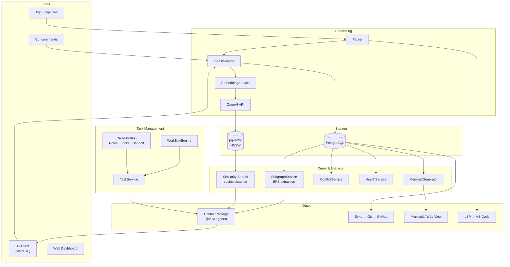

---

## Design Rules

| Rule | Description |
|---|---|
| **R1** | ALL SQL lives in `KgnRepository` — no SQL in services or handlers |
| **R5** | `agent_activities` table is INSERT-only (audit log) |
| **R8** | All embedding API calls go through `EmbeddingClient` Protocol |
| **R10** | Task state transitions only via `TaskService` / `KgnRepository` |
| **R12** | MCP handlers contain no business logic — delegate to services |
| **R16** | Agent without role defaults to `admin` (full access) |
| **R23** | LSP: blocking work must use `asyncio.to_thread()` |
| **R24** | `parse_kgn_tolerant()` never raises exceptions |
| **V7** | Node upsert validates `supersedes` target exists |
| **V8** | Content-hash deduplication: same hash → SKIPPED |
