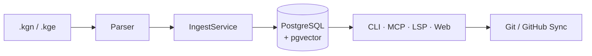

# kgn

<picture>
  <source media="(prefers-color-scheme: dark)" srcset="assets/kgn-banner-dark.png">
  <source media="(prefers-color-scheme: light)" srcset="assets/kgn-banner-light.png">
  
</picture>

[](https://github.com/baobab00/kgn/actions/workflows/ci.yml)
[](https://pypi.org/project/kgn-mcp/)
[](https://pypi.org/project/kgn-mcp/)
[](LICENSE)
[](https://codecov.io/gh/baobab00/kgn)
[](https://github.com/baobab00/kgn/actions)
[](https://github.com/astral-sh/ruff)

> **Manage your AI agent's knowledge — parse, store, query, and collaborate.**

KGN is a developer-friendly CLI + MCP server for teams building with AI agents.
Write knowledge nodes in simple YAML+Markdown files (`.kgn`), define relationships
between them (`.kge`), and let KGN handle storage, similarity search, conflict
detection, and multi-agent task handoffs — all backed by PostgreSQL + pgvector.

**Hybrid architecture:** PostgreSQL is the local working engine; GitHub is the
long-term source of truth. Export, commit, and push in one command.

---

## Table of Contents

- [Architecture](#architecture)
- [Why KGN?](#why-kgn)
- [Quick Start](#quick-start)
- [MCP Server (Claude Integration)](#mcp-server-claude-integration)
- [Multi-Agent Orchestration](#multi-agent-orchestration)
- [CLI Commands](#cli-commands)
- [File Formats](#file-formats)
- [Development](#development)
- [Tech Stack](#tech-stack)

---

## Architecture

For a deep dive into KGN's internal design — layer structure, module dependencies, database schema, data flows, and more — see the full **[Architecture Guide](ARCHITECTURE.md)** with 16 interactive Mermaid diagrams.



---

## Why KGN?

AI agents are powerful, but they forget everything between sessions — and when multiple agents collaborate, they can conflict, duplicate work, or lose track of decisions.

KGN gives your agents a **shared, queryable memory**:

| Problem | KGN Solution |
|---|---|
| Agents forget past decisions | Persistent knowledge graph in PostgreSQL |
| Duplicate work across agents | Conflict detection + similarity search |
| No task coordination | Built-in task queue with lease management |
| Hard to audit agent actions | Structured activity log per agent |
| Context window overflow | Subgraph extraction — only what's relevant |
| IDE friction for `.kgn` files | VS Code extension with LSP support |

---

## Quick Start

> **📖 New to KGN?** Follow the step-by-step **[Getting Started Guide](GUIDE.md)** ( [한국어](GUIDE_KO.md) ) — no prior experience required.

### Install

```bash
pip install kgn-mcp
```

### Start Database

```bash
git clone https://github.com/baobab00/kgn.git && cd kgn
docker compose -f docker/docker-compose.yml up -d postgres
```

### First Run

```bash
kgn init --project my-project
kgn ingest examples/ --project my-project --recursive
kgn status --project my-project
```

<details>
<summary><b>Embedding Provider Setup</b></summary>

To use embedding features, set your OpenAI API key in the `.env` file:

```bash
# .env
KGN_OPENAI_API_KEY=sk-your-api-key-here
KGN_OPENAI_EMBED_MODEL=text-embedding-3-small    # default
```

If the API key is not set, ingest works normally and embedding is silently skipped (graceful degradation).

```bash
# Test provider connection
kgn embed provider test
```

</details>

<details>
<summary><b>Docker All-in-One</b></summary>

Run PostgreSQL + kgn CLI together with Docker:

```bash
docker compose -f docker/docker-compose.yml up -d --build
docker compose -f docker/docker-compose.yml exec kgn kgn init --project my-project
docker compose -f docker/docker-compose.yml exec kgn kgn --help
```

Place `.kgn`/`.kge` files in `docker/workspace/` directory.

</details>

---

## MCP Server (Claude Integration)

The MCP (Model Context Protocol) server enables Claude to directly read, write, and manage tasks in the knowledge graph.

```bash
# stdio mode (Claude Desktop / Claude Code default)
kgn mcp serve --project my-project

# HTTP SSE mode
KGN_MCP_TRANSPORT=sse KGN_MCP_PORT=8000 kgn mcp serve --project my-project

# streamable-http mode
KGN_MCP_TRANSPORT=streamable-http kgn mcp serve --project my-project
```

**Claude Desktop integration** — add to `claude_desktop_config.json`:

```json
{
  "mcpServers": {
    "kgn": {
      "command": "uv",
      "args": ["run", "kgn", "mcp", "serve", "--project", "my-project"]
    }
  }
}
```

<details>
<summary><b>MCP Tools (12 tools)</b></summary>

| Tool | Category | Description |
|---|---|---|
| `get_node` | Read | Get node by ID |
| `query_nodes` | Read | Search nodes in project (type/status filter) |
| `get_subgraph` | Read | BFS subgraph extraction from node |
| `query_similar` | Read | Vector similarity Top-K search |
| `task_checkout` | Task | Check out highest-priority task (with auto lease recovery) |
| `task_complete` | Task | Mark task as complete (auto-unblocks dependent tasks) |
| `task_fail` | Task | Mark task as failed |
| `workflow_list` | Workflow | List registered workflow templates |
| `workflow_run` | Workflow | Execute a workflow template (creates subtask DAG) |
| `ingest_node` | Write | Ingest node from .kgn string |
| `ingest_edge` | Write | Ingest edge from .kge string |
| `enqueue_task` | Write | Enqueue TASK node |

</details>

<details>
<summary><b>Git/GitHub Sync</b></summary>

```bash
# Export DB → filesystem (+ auto-generate Mermaid README)
kgn sync export --project my-project --target ./sync

# Import filesystem → DB
kgn sync import --project my-project --source ./sync

# Push/pull to GitHub
kgn sync push --project my-project --target ./sync
kgn sync pull --project my-project --target ./sync

# Mermaid visualization
kgn graph mermaid --project my-project
kgn graph readme --project my-project --target ./sync

# Branch/PR management
kgn git branch list --target ./sync
kgn git pr create --project my-project --target ./sync --title "PR title"
```

</details>

<details>
<summary><b>Web Dashboard</b></summary>

```bash
pip install kgn-mcp[web]
kgn web serve --project my-project --port 8080
```

Open http://localhost:8080 — Graph View, Task Board, Health Dashboard, Search & Filter.

</details>

<details>
<summary><b>VS Code Extension</b></summary>

```bash
code --install-extension baobab00.vscode-kgn
pip install kgn-mcp[lsp]    # for LSP features
```

Syntax Highlighting, Diagnostics, Auto-completion, Hover, Go to Definition, CodeLens, Subgraph Preview.

</details>

<details>
<summary><b>Error Code System</b></summary>

All MCP error responses are returned as structured JSON:

```json
{
  "error": "Error message",
  "code": "KGN-300",
  "detail": "Detailed description",
  "recoverable": false
}
```

| Code | Category | Description | Retryable |
|---|---|---|---|
| `KGN-100` | Infrastructure | Database connection failed | ✅ |
| `KGN-101` | Infrastructure | Embedding provider unavailable | ✅ |
| `KGN-200` | Ingest | YAML front matter parse error | ❌ |
| `KGN-201` | Ingest | Required field missing | ❌ |
| `KGN-202` | Ingest | Invalid field value | ❌ |
| `KGN-300` | Query | Node not found | ❌ |
| `KGN-301` | Query | Invalid UUID format | ❌ |
| `KGN-302` | Query | Subgraph depth limit exceeded | ❌ |
| `KGN-400` | Task | No READY tasks available | ❌ |
| `KGN-401` | Task | Task not in expected state | ❌ |
| `KGN-402` | Task | Lease expired | ✅ |
| `KGN-999` | Internal | Unexpected server error | ✅ |

</details>

## Multi-Agent Orchestration

KGN supports multi-agent collaborative workflows where multiple AI agents work together on a knowledge graph with role-based access control, task handoff, and conflict resolution.

- **5 Agent Roles** — genesis, worker, reviewer, indexer, admin with role-based access control
- **3 Workflow Templates** — design-to-impl, issue-resolution, knowledge-indexing
- **Task Handoff** — Automatic context propagation between workflow steps
- **Advisory Locking** — Prevents concurrent modifications to the same node
- **Conflict Resolution** — Detects conflicts and auto-creates review tasks
- **Observability** — Agent activity timeline, task flow stats, bottleneck detection

<details>
<summary><b>Agent Roles & Workflow Details</b></summary>

| Role | Create | Checkout | Description |
|---|---|---|---|
| **genesis** | GOAL, SPEC, ARCH, CONSTRAINT, ASSUMPTION | — | Project bootstrapping |
| **worker** | SPEC, ARCH, LOGIC, TASK, SUMMARY | ✅ (role-filtered) | Implementation work |
| **reviewer** | DECISION, ISSUE, SUMMARY | ✅ (role-filtered) | Code review & decisions |
| **indexer** | SUMMARY | — | Knowledge indexing |
| **admin** | All types | ✅ (all tasks) | Full access |

| Template | Steps | Description |
|---|---|---|
| `design-to-impl` | GOAL → SPEC → ARCH → TASK(impl) → TASK(review) | Full design-to-implementation pipeline |
| `issue-resolution` | ISSUE → TASK(fix) → TASK(verify) | Bug fix workflow |
| `knowledge-indexing` | GOAL → TASK(index) → TASK(review) | Knowledge capture pipeline |

```bash
kgn agent list --project my-project
kgn agent role --project my-project --agent-id <uuid> --role worker
kgn agent stats --project my-project --agent-id <uuid>
kgn agent timeline --project my-project --agent-id <uuid>
```

</details>

## CLI Commands

> Run `kgn --help` for the full command list.

Key commands summary:

| Group | Example | Description |
|---|---|---|
| **Core** | `kgn init`, `kgn ingest`, `kgn status`, `kgn health` | Initialize, ingest, status, health |
| **Query** | `kgn query nodes`, `kgn query subgraph`, `kgn query similar` | Search, subgraph, similarity |
| **Task** | `kgn task enqueue/checkout/complete/fail/list/log` | Task orchestration |
| **Embed** | `kgn embed`, `kgn embed provider test` | Embedding management |
| **Conflict** | `kgn conflict scan/approve/dismiss` | Conflict detection/management |
| **Sync** | `kgn sync export/import/status/push/pull` | DB ↔ file ↔ GitHub sync |
| **Git** | `kgn git init/status/diff/log/branch/pr` | Git/GitHub management |
| **Graph** | `kgn graph mermaid/readme` | Mermaid visualization |
| **MCP** | `kgn mcp serve` | MCP server (stdio/sse/streamable-http) |
| **Agent** | `kgn agent list/role/stats/timeline` | Multi-agent orchestration |
| **Web** | `kgn web serve` | Web visualization dashboard |
| **LSP** | `kgn lsp serve` | Language Server (VS Code integration) |

<details>
<summary><b>Expired Task Recovery</b></summary>

When a checked-out task exceeds its `lease_expires_at`, it is considered **expired**.
`requeue_expired` resets expired `IN_PROGRESS` tasks to `READY` and increments `attempts`.

- **MCP:** `checkout` automatically calls `requeue_expired` beforehand
- **CLI:** Manual invocation or cron schedule required
- When `max_attempts` (default 3) is exceeded, the task transitions to `FAILED`

</details>

## File Formats

<details>
<summary><b>.kgn — Knowledge Graph Node</b></summary>

```yaml
---
kgn_version: "0.1"
id: "new:my-node"        # UUID or new:slug
type: SPEC               # GOAL, ARCH, SPEC, LOGIC, DECISION, ISSUE, TASK, CONSTRAINT, ASSUMPTION, SUMMARY
title: "Node title"
status: ACTIVE            # ACTIVE, DEPRECATED, SUPERSEDED, ARCHIVED
project_id: "my-project"
agent_id: "my-agent"
tags: ["tag1", "tag2"]
confidence: 0.9
---

## Context
...
## Content
...
```

</details>

<details>
<summary><b>.kge — Edge Definition</b></summary>

```yaml
---
kgn_version: "0.1"
project_id: "my-project"
agent_id: "my-agent"
edges:
  - from: "new:node-a"
    to:   "new:node-b"
    type: DEPENDS_ON      # DEPENDS_ON, IMPLEMENTS, RESOLVES, SUPERSEDES, DERIVED_FROM, CONTRADICTS, CONSTRAINED_BY
    note: "Edge description"
---
```

</details>

See `examples/` directory for practical `.kgn` and `.kge` file examples.

## Development

```bash
# Lint
uv run ruff check .

# Format
uv run ruff format .

# Test
uv run pytest --tb=short -q

# Coverage
uv run pytest --cov=kgn --cov-report=term-missing
```

## Tech Stack

| Layer | Technology |
|---|---|
| **Language** | Python 3.12+ |
| **CLI** | [Typer](https://typer.tiangolo.com/) + [Rich](https://rich.readthedocs.io/) |
| **DB** | PostgreSQL 16 + [pgvector](https://github.com/pgvector/pgvector) |
| **ORM/SQL** | [psycopg3](https://www.psycopg.org/psycopg3/) (native async-ready) |
| **Validation** | [Pydantic v2](https://docs.pydantic.dev/) |
| **AI Protocol** | [MCP 1.26.0](https://modelcontextprotocol.io/) via FastMCP |
| **Embeddings** | OpenAI `text-embedding-3-small` (optional) |
| **Git/GitHub** | bidirectional sync (DB \u2194 GitHub) |
| **Logging** | [structlog](https://www.structlog.org/) (JSON / console) |
| **Web** | FastAPI + Uvicorn + Jinja2 + Cytoscape.js (optional extra) |
| **IDE** | VS Code extension + pygls LSP (optional extra) |
| **Infra** | Docker Compose + GitHub Actions CI |
| **Quality** | [ruff](https://docs.astral.sh/ruff/) + pytest (2031 tests, 93%+ coverage) |

## License

MIT
