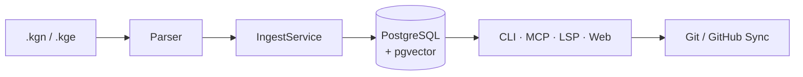

# kgn

🌐 [English](README.md) | **한국어**

<picture>
  <source media="(prefers-color-scheme: dark)" srcset="assets/kgn-banner-dark.png">
  <source media="(prefers-color-scheme: light)" srcset="assets/kgn-banner-light.png">
  
</picture>

[](https://github.com/baobab00/kgn/actions/workflows/ci.yml)
[](https://pypi.org/project/kgn-mcp/)
[](https://pypi.org/project/kgn-mcp/)
[](LICENSE)
[](https://codecov.io/gh/baobab00/kgn)
[](https://github.com/baobab00/kgn/actions)
[](https://github.com/astral-sh/ruff)

> **AI 에이전트의 지식을 체계적으로 관리하세요 — 수집부터 저장, 검색, 협업까지 한번에.**

KGN은 AI 에이전트 기반 팀을 위한 CLI + MCP 서버입니다.
YAML+Markdown 형식의 `.kgn` 파일로 지식 노드를 작성하고, `.kge` 파일로 노드 간
관계를 정의하면 — 저장, 유사도 검색, 충돌 감지, 에이전트 간 작업 인계까지
KGN이 알아서 처리합니다. PostgreSQL + pgvector 기반.

**하이브리드 아키텍처:** 로컬에서는 PostgreSQL이 작업 엔진 역할을 하고,
GitHub이 장기 원본 저장소 역할을 합니다. 내보내기 → 커밋 → 푸시를 한 명령어로 끝낼 수 있습니다.

---

## 목차

- [아키텍처](#아키텍처)
- [왜 KGN인가?](#왜-kgn인가)
- [빠른 시작](#빠른-시작)
- [MCP 서버 (Claude 연동)](#mcp-서버-claude-연동)
- [멀티 에이전트 오케스트레이션](#멀티-에이전트-오케스트레이션)
- [CLI 명령어](#cli-명령어)
- [파일 형식](#파일-형식)
- [개발](#개발)
- [기술 스택](#기술-스택)

---

## 아키텍처

계층 구조, 모듈 의존성, DB 스키마, 데이터 흐름 등 내부 설계를 자세히 알고 싶다면 Mermaid 다이어그램 16개가 포함된 **[아키텍처 가이드](ARCHITECTURE.md)**를 참조하세요.



---

## 왜 KGN인가?

AI 에이전트는 강력하지만, 세션이 끝나면 모든 것을 잊습니다.
여러 에이전트가 함께 일하면 작업이 겹치거나, 서로 충돌하거나, 이전 결정을 놓치기 쉽습니다.

KGN은 에이전트에게 **함께 쓸 수 있는 공유 메모리**를 제공합니다:

| 문제 | KGN이 해결하는 방법 |
|---|---|
| 에이전트가 과거 결정을 기억하지 못함 | PostgreSQL에 지식 그래프를 영구 저장 |
| 에이전트끼리 같은 일을 반복 | 충돌 감지 + 유사도 검색으로 중복 방지 |
| 작업 순서를 조율할 방법이 없음 | 임대(lease) 기반 작업 큐 내장 |
| 에이전트가 뭘 했는지 추적이 어려움 | 에이전트별 활동 이력 자동 기록 |
| 컨텍스트 창이 넘침 | 서브그래프 추출로 필요한 정보만 전달 |
| `.kgn` 파일을 IDE에서 다루기 불편 | VS Code 확장 + LSP 지원 |

---

## 빠른 시작

> **📖 처음이신가요?** **[시작 가이드](GUIDE_KO.md)** ( [English](GUIDE.md) )를 따라하면 누구나 바로 시작할 수 있습니다.

### 설치

```bash
pip install kgn-mcp
```

### 데이터베이스 시작

```bash
git clone https://github.com/baobab00/kgn.git && cd kgn
docker compose -f docker/docker-compose.yml up -d postgres
```

### 첫 실행

```bash
kgn init --project my-project
kgn ingest examples/ --project my-project --recursive
kgn status --project my-project
```

<details>
<summary><b>임베딩 설정</b></summary>

임베딩 기능을 쓰려면 `.env` 파일에 OpenAI API 키를 넣으세요:

```bash
# .env
KGN_OPENAI_API_KEY=sk-your-api-key-here
KGN_OPENAI_EMBED_MODEL=text-embedding-3-small    # 기본값
```

API 키가 없어도 데이터 수집은 정상 동작하며, 임베딩만 자동으로 건너뜁니다.

```bash
# 임베딩 연결 테스트
kgn embed provider test
```

</details>

<details>
<summary><b>Docker 올인원</b></summary>

Docker 하나로 PostgreSQL과 kgn CLI를 동시에 실행할 수 있습니다:

```bash
docker compose -f docker/docker-compose.yml up -d --build
docker compose -f docker/docker-compose.yml exec kgn kgn init --project my-project
docker compose -f docker/docker-compose.yml exec kgn kgn --help
```

`.kgn`/`.kge` 파일은 `docker/workspace/` 디렉터리에 넣으면 됩니다.

</details>

---

## MCP 서버 (Claude 연동)

MCP(Model Context Protocol) 서버를 띄우면, Claude가 지식 그래프를 직접 읽고 쓰며 작업을 관리할 수 있습니다.

```bash
# stdio 모드 (Claude Desktop / Claude Code 기본값)
kgn mcp serve --project my-project

# HTTP SSE 모드
KGN_MCP_TRANSPORT=sse KGN_MCP_PORT=8000 kgn mcp serve --project my-project

# streamable-http 모드
KGN_MCP_TRANSPORT=streamable-http kgn mcp serve --project my-project
```

**Claude Desktop 연동** — `claude_desktop_config.json`에 아래 내용을 추가하세요:

```json
{
  "mcpServers": {
    "kgn": {
      "command": "uv",
      "args": ["run", "kgn", "mcp", "serve", "--project", "my-project"]
    }
  }
}
```

<details>
<summary><b>MCP 도구 (12개)</b></summary>

| 도구 | 카테고리 | 설명 |
|---|---|---|
| `get_node` | 읽기 | ID로 노드 조회 |
| `query_nodes` | 읽기 | 프로젝트 내 노드 검색 (타입/상태 필터) |
| `get_subgraph` | 읽기 | 노드 기준 BFS 서브그래프 추출 |
| `query_similar` | 읽기 | 벡터 유사도 Top-K 검색 |
| `task_checkout` | 작업 | 우선순위가 가장 높은 작업을 가져옴 (만료 임대 자동 복구) |
| `task_complete` | 작업 | 작업 완료 처리 (후속 작업 자동 해제) |
| `task_fail` | 작업 | 작업 실패 처리 |
| `workflow_list` | 워크플로 | 등록된 워크플로 템플릿 목록 조회 |
| `workflow_run` | 워크플로 | 워크플로 실행 (하위 작업 DAG 자동 생성) |
| `ingest_node` | 쓰기 | .kgn 문자열로 노드 수집 |
| `ingest_edge` | 쓰기 | .kge 문자열로 엣지 수집 |
| `enqueue_task` | 쓰기 | TASK 노드를 작업 큐에 등록 |

</details>

<details>
<summary><b>Git/GitHub 동기화</b></summary>

```bash
# DB → 파일시스템 내보내기 (+ Mermaid README 자동 생성)
kgn sync export --project my-project --target ./sync

# 파일시스템 → DB 가져오기
kgn sync import --project my-project --source ./sync

# GitHub 푸시/풀
kgn sync push --project my-project --target ./sync
kgn sync pull --project my-project --target ./sync

# Mermaid 시각화
kgn graph mermaid --project my-project
kgn graph readme --project my-project --target ./sync

# 브랜치/PR 관리
kgn git branch list --target ./sync
kgn git pr create --project my-project --target ./sync --title "PR 제목"
```

</details>

<details>
<summary><b>웹 대시보드</b></summary>

```bash
pip install kgn-mcp[web]
kgn web serve --project my-project --port 8080
```

http://localhost:8080 에 접속하면 그래프 시각화, 작업 현황판, 상태 대시보드, 검색/필터 기능을 사용할 수 있습니다.

</details>

<details>
<summary><b>VS Code 확장</b></summary>

```bash
code --install-extension baobab00.vscode-kgn
pip install kgn-mcp[lsp]    # LSP 기능용
```

구문 강조, 실시간 진단, 자동 완성, 마우스 오버 정보, 정의로 이동, CodeLens, 서브그래프 미리보기를 지원합니다.

</details>

<details>
<summary><b>에러 코드 시스템</b></summary>

모든 MCP 오류 응답은 아래와 같은 JSON 형식으로 반환됩니다:

```json
{
  "error": "에러 메시지",
  "code": "KGN-300",
  "detail": "상세 설명",
  "recoverable": false
}
```

| 코드 | 카테고리 | 설명 | 재시도 가능 |
|---|---|---|---|
| `KGN-100` | 인프라 | DB 연결 실패 | ✅ |
| `KGN-101` | 인프라 | 임베딩 제공자 응답 없음 | ✅ |
| `KGN-200` | 수집 | YAML 프론트매터 파싱 실패 | ❌ |
| `KGN-201` | 수집 | 필수 필드 누락 | ❌ |
| `KGN-202` | 수집 | 유효하지 않은 필드 값 | ❌ |
| `KGN-300` | 조회 | 노드 없음 | ❌ |
| `KGN-301` | 조회 | UUID 형식 오류 | ❌ |
| `KGN-302` | 조회 | 서브그래프 깊이 한도 초과 | ❌ |
| `KGN-400` | 작업 | 대기 중인 작업 없음 | ❌ |
| `KGN-401` | 작업 | 작업 상태 불일치 | ❌ |
| `KGN-402` | 작업 | 임대 시간 만료 | ✅ |
| `KGN-999` | 내부 | 예상치 못한 서버 오류 | ✅ |

</details>

## 멀티 에이전트 오케스트레이션

여러 AI 에이전트가 하나의 지식 그래프 위에서 함께 일할 수 있도록, 역할 기반 권한 관리·작업 인계·충돌 해결 기능을 제공합니다.

- **5가지 역할** — genesis, worker, reviewer, indexer, admin (역할별 권한 분리)
- **3가지 워크플로 템플릿** — design-to-impl, issue-resolution, knowledge-indexing
- **작업 인계** — 워크플로 단계가 넘어갈 때 컨텍스트를 자동으로 전달
- **선점 잠금** — 같은 노드를 동시에 수정하지 못하도록 보호
- **충돌 해결** — 충돌이 감지되면 리뷰 작업을 자동 생성
- **모니터링** — 에이전트 활동 타임라인, 작업 흐름 통계, 병목 구간 탐지

<details>
<summary><b>에이전트 역할 및 워크플로 상세</b></summary>

| 역할 | 생성 가능 노드 | 작업 수령 | 설명 |
|---|---|---|---|
| **genesis** | GOAL, SPEC, ARCH, CONSTRAINT, ASSUMPTION | — | 프로젝트 초기 설계 |
| **worker** | SPEC, ARCH, LOGIC, TASK, SUMMARY | ✅ (역할별 필터) | 구현 담당 |
| **reviewer** | DECISION, ISSUE, SUMMARY | ✅ (역할별 필터) | 리뷰 및 의사결정 |
| **indexer** | SUMMARY | — | 지식 정리 |
| **admin** | 전체 | ✅ (제한 없음) | 전체 관리 |

| 템플릿 | 단계 | 설명 |
|---|---|---|
| `design-to-impl` | GOAL → SPEC → ARCH → TASK(구현) → TASK(리뷰) | 설계에서 구현까지 전 과정 |
| `issue-resolution` | ISSUE → TASK(수정) → TASK(검증) | 이슈 해결 흐름 |
| `knowledge-indexing` | GOAL → TASK(정리) → TASK(리뷰) | 지식 수집·정리 흐름 |

```bash
kgn agent list --project my-project
kgn agent role --project my-project --agent-id <uuid> --role worker
kgn agent stats --project my-project --agent-id <uuid>
kgn agent timeline --project my-project --agent-id <uuid>
```

</details>

## CLI 명령어

> `kgn --help`로 전체 명령어를 확인할 수 있습니다.

주요 명령어 요약:

| 그룹 | 예시 | 설명 |
|---|---|---|
| **기본** | `kgn init`, `kgn ingest`, `kgn status`, `kgn health` | 초기화, 데이터 수집, 상태 확인 |
| **조회** | `kgn query nodes`, `kgn query subgraph`, `kgn query similar` | 노드 검색, 서브그래프, 유사도 |
| **작업** | `kgn task enqueue/checkout/complete/fail/list/log` | 작업 큐 관리 |
| **임베딩** | `kgn embed`, `kgn embed provider test` | 임베딩 관리 |
| **충돌** | `kgn conflict scan/approve/dismiss` | 충돌 감지·처리 |
| **동기화** | `kgn sync export/import/status/push/pull` | DB ↔ 파일 ↔ GitHub 동기화 |
| **Git** | `kgn git init/status/diff/log/branch/pr` | Git/GitHub 관리 |
| **그래프** | `kgn graph mermaid/readme` | Mermaid 시각화 |
| **MCP** | `kgn mcp serve` | MCP 서버 (stdio/sse/streamable-http) |
| **에이전트** | `kgn agent list/role/stats/timeline` | 멀티 에이전트 관리 |
| **웹** | `kgn web serve` | 웹 대시보드 |
| **LSP** | `kgn lsp serve` | 언어 서버 (VS Code 연동) |

<details>
<summary><b>만료된 태스크 복구</b></summary>

작업을 가져간 뒤 `lease_expires_at` 시간이 지나면 해당 작업은 **만료** 상태가 됩니다.
`requeue_expired`는 만료된 `IN_PROGRESS` 작업을 `READY`로 되돌리고 `attempts` 횟수를 1 올립니다.

- **MCP:** `checkout` 시 자동으로 `requeue_expired`를 먼저 실행합니다
- **CLI:** 수동으로 실행하거나 cron에 등록해야 합니다
- `max_attempts`(기본값 3)를 넘기면 작업이 `FAILED`로 전환됩니다

</details>

## 파일 형식

<details>
<summary><b>.kgn — 지식 그래프 노드</b></summary>

```yaml
---
kgn_version: "0.1"
id: "new:my-node"        # UUID 또는 new:slug
type: SPEC               # GOAL, ARCH, SPEC, LOGIC, DECISION, ISSUE, TASK, CONSTRAINT, ASSUMPTION, SUMMARY
title: "노드 제목"
status: ACTIVE            # ACTIVE, DEPRECATED, SUPERSEDED, ARCHIVED
project_id: "my-project"
agent_id: "my-agent"
tags: ["tag1", "tag2"]
confidence: 0.9
---

## Context
...
## Content
...
```

</details>

<details>
<summary><b>.kge — 엣지 정의</b></summary>

```yaml
---
kgn_version: "0.1"
project_id: "my-project"
agent_id: "my-agent"
edges:
  - from: "new:node-a"
    to:   "new:node-b"
    type: DEPENDS_ON      # DEPENDS_ON, IMPLEMENTS, RESOLVES, SUPERSEDES, DERIVED_FROM, CONTRADICTS, CONSTRAINED_BY
    note: "엣지 설명"
---
```

</details>

`.kgn`/`.kge` 파일의 실제 사용 예시는 `examples/` 디렉터리에서 확인할 수 있습니다.

## 개발

```bash
# 린트
uv run ruff check .

# 포맷
uv run ruff format .

# 테스트
uv run pytest --tb=short -q

# 커버리지
uv run pytest --cov=kgn --cov-report=term-missing
```

## 기술 스택

| 레이어 | 기술 |
|---|---|
| **언어** | Python 3.12+ |
| **CLI** | [Typer](https://typer.tiangolo.com/) + [Rich](https://rich.readthedocs.io/) |
| **DB** | PostgreSQL 16 + [pgvector](https://github.com/pgvector/pgvector) |
| **ORM/SQL** | [psycopg3](https://www.psycopg.org/psycopg3/) (비동기 네이티브) |
| **유효성 검사** | [Pydantic v2](https://docs.pydantic.dev/) |
| **AI 프로토콜** | [MCP 1.26.0](https://modelcontextprotocol.io/) via FastMCP |
| **임베딩** | OpenAI `text-embedding-3-small` (선택) |
| **Git/GitHub** | DB ↔ GitHub 양방향 동기화 |
| **로깅** | [structlog](https://www.structlog.org/) (JSON / 콘솔) |
| **웹** | FastAPI + Uvicorn + Jinja2 + Cytoscape.js (선택) |
| **IDE** | VS Code 확장 + pygls LSP (선택) |
| **인프라** | Docker Compose + GitHub Actions CI |
| **품질** | [ruff](https://docs.astral.sh/ruff/) + pytest (2081+ 테스트, 93%+ 커버리지) |

## 라이선스

MIT
